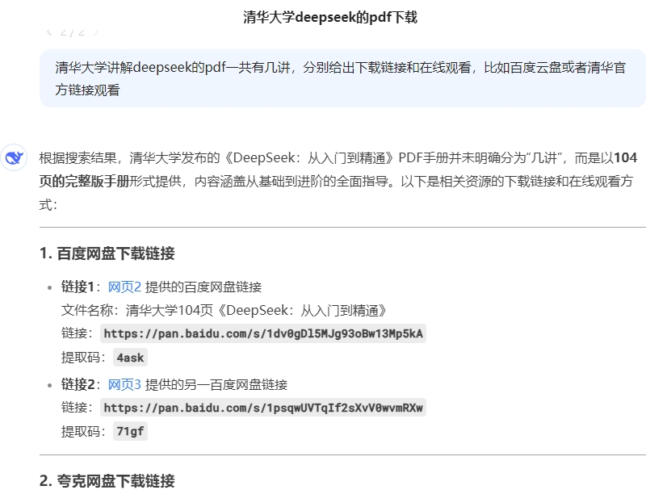
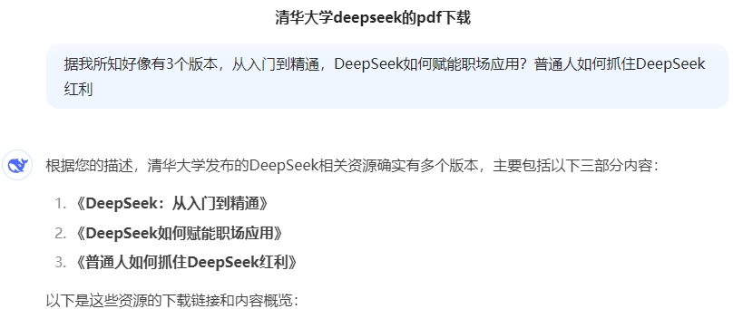
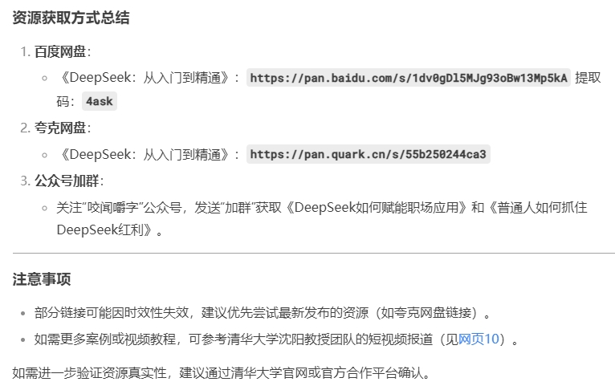
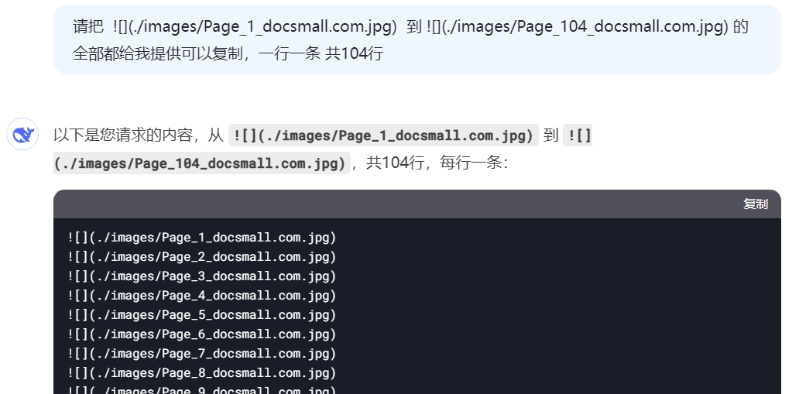

嵌入式AI(1)如何获取清华大学DeepSeek系列pdf资料
===
[toc]

# 一、概述
- 分享清华大学DeepSeek系列pdf，无需加群、充值，在线阅读更方便
- 分享获取清华大学DeepSeek系列pdf的方法
- 清华大学DeepSeek系列pdf目前有3个：
  (1)[清华大学的DeepSeek从入门到精通.pdf](../02_tsinghua01/doc/清华大学的DeepSeek从入门到精通.pdf)
  (2)[DeepSeek如何赋能职场应用.pdf](../03_tsinghua02/doc/DeepSeek如何赋能职场应用-清华大学.pdf)
  (3)[普通人如何抓住DeepSeek红利.pdf](../04_tsinghua03/doc/清华大学第三弹-普通人如何抓住DeepSeek红利.pdf)
  
- 可在我的公众号、CSDN、github、gitee免费在线阅读、下载

# 二、提问DeepSeek---如何下载清华大学DeepSeek系列pdf

- 详细提问



- 引导提问



- 答案也不是完美的




# 三、DeepSeek官方资料
https://api-docs.deepseek.com/zh-cn/
https://github.com/deepseek-ai/DeepSeek-R1


# 四、DeepSeek应用的第一个例子
本来通过markdown文档格式实现，插入图片的语法是：
```

```
那么如何一次性插入清华大学的DeepSeek从入门到精通的104张图片呢？



# 五、总结
- 免费分享清华大学DeepSeek系列pdf，在线、下载
- 可以询问deepseek如何获取清华大学DeepSeek系列
- 通过Markdown图片批量导入的例子，可发现AI的高效率
  