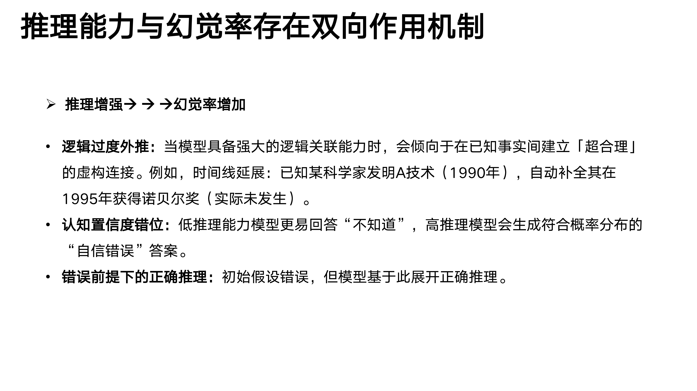

嵌入式AI(6)清华大学DeepSeek 05：普通人如何抓住DeepSeek红利
===
[toc]
下载：
https://gitee.com/292812832/embedded-AI/blob/main/02_tsinghua01/doc/%E6%B8%85%E5%8D%8E%E5%A4%A7%E5%AD%A6%E7%9A%84DeepSeek%E4%BB%8E%E5%85%A5%E9%97%A8%E5%88%B0%E7%B2%BE%E9%80%9A.pdf

https://gitee.com/292812832/embedded-AI/blob/main/03_tsinghua02/doc/DeepSeek%E5%A6%82%E4%BD%95%E8%B5%8B%E8%83%BD%E8%81%8C%E5%9C%BA%E5%BA%94%E7%94%A8-%E6%B8%85%E5%8D%8E%E5%A4%A7%E5%AD%A6.pdf

https://gitee.com/292812832/embedded-AI/blob/main/04_tsinghua03/doc/%E6%B8%85%E5%8D%8E%E5%A4%A7%E5%AD%A6%E7%AC%AC%E4%B8%89%E5%BC%B9-%E6%99%AE%E9%80%9A%E4%BA%BA%E5%A6%82%E4%BD%95%E6%8A%93%E4%BD%8FDeepSeek%E7%BA%A2%E5%88%A9.pdf

一、什么是AI幻觉
二、DeepSeek为什么会产生幻觉
三、AI幻觉评测
四、如何减缓AI幻觉
五、AI幻觉的创造力价值

